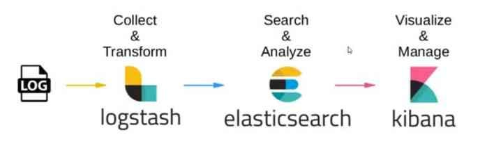

# ELK Stack

The ELK Stack, consisting of Elasticsearch, Logstash, and Kibana, is a powerful open-source solution for log management
and analysis. 

## What is the ELK Stack?

The **ELK Stack** is a set of three essential components used for log management and analysis:

1. **Elasticsearch:** A highly scalable, distributed search and analytics engine. It's used to store, search, and
   retrieve log data efficiently.

2. **Logstash:** A data processing pipeline tool that ingests, processes, and transforms log data from various sources
   before sending it to Elasticsearch for storage and analysis.

3. **Kibana:** A powerful data visualization and exploration tool that allows users to interact with data stored in
   Elasticsearch. It provides customizable dashboards, visualizations, and search capabilities.

## How the ELK Stack Works

The ELK Stack follows a streamlined process for log management and analysis:

1. **Data Ingestion:** Log data is generated by various sources, such as applications, servers, and network devices.
   Logstash, the data processing component, collects these logs.

2. **Data Transformation:** Logstash processes the incoming logs, transforming them into a standardized format (e.g.,
   JSON) and performing filtering or enrichment as needed.

3. **Data Storage:** Transformed log data is stored in Elasticsearch. Elasticsearch's distributed architecture enables
   efficient storage, indexing, and retrieval of log data.

4. **Data Visualization:** Kibana serves as the user interface for interacting with the log data. Users can create
   custom dashboards, visualizations, and queries to gain insights from the logs.

5. **Search and Analysis:** Kibana provides powerful search and analysis capabilities, allowing users to search for
   specific log entries, create visualizations, and monitor system performance.

## Components of the ELK Stack

### ELK Architecture

### Elasticsearch

- **Data Storage:** Elasticsearch efficiently stores and indexes log data, making it searchable and accessible.

- **Query and Search:** Elasticsearch offers a RESTful API for querying log data, enabling complex searches and
  aggregations.

### Logstash

- **Data Collection:** Logstash collects log data from various sources, including files, applications, and network
  protocols.

- **Data Transformation:** Logstash processes log data, applies filters, and transforms it into a consistent format.

- **Data Routing:** Logstash routes the transformed data to the appropriate destination, such as Elasticsearch.

### Kibana

- **Data Visualization:** Kibana provides a web-based interface for creating visualizations, dashboards, and real-time
  monitoring.

- **Interactive Queries:** Users can interact with log data through Kibana's search and query capabilities.

----

[Home](../README.md)